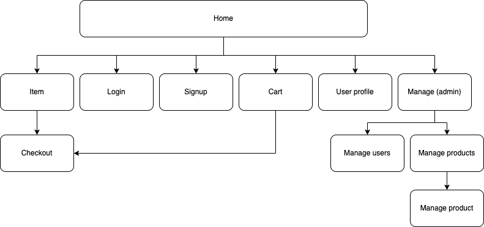

# An online store - Brusinhas

## Group 2

- Luísa Souza Moura - 10692179
- Thiago Preischadt Pinheiro  - 10723801

## Requirements

- There must be 2 types of users: customers and admins.
  - Customers are users who access the system to buy shirts.
  - Administrators are resposible for managing users and products. The default admin account is `admin@gmail.com` with password `admin`.
- The admin record includes: name, id, phone, email.
- Customer records include:  name, id, address, phone, email.
- Product records include: shirt name, shirt description, shirt category, id, photo, price, quantity in stock for each size, quantity sold.
  - Shirt categories can be: camisa, regata, linha básica or estilosa.
- Process of ordering shirt(s): select products, quantity and size  and add to the cart or proceed to checkout. The order is finished by using a credit card (any card number with the right format is accepted). The quantities of each of the sold products are updated in the system: subtract the quantity in stock and add to the quantity sold. Carts are emptied only after payment or by customers choice.
- Product management: admins can create, update, read and delete (CRUD) shirts records (e.g. quantity in stock, shirt category).
- The system must provide accessibility requirements and provide good usability. The system must be responsive.

## Project Description

The project is a T-shirt online store named Brusinhas.

The store has the following functionalities:
- For users:
  - Create an account
  - Login (via email/password)
  - Update their profile
  - Navigate throw the products, seeing all of them or a subset
  - Select products and see more details about them
  - Add a certain product to the cart, after choosing the size and amount
  - View cart items and update quantities from there
  - Finish purchase
- For administrators:
  - Manage users (see, remove and make administrator)
  - Manage products (see, remove, update and create)

Screen mockups are available in this repository and can be found in [mockup](/mockup) folder. They were made using figma ([direct link to the project](https://www.figma.com/file/qaK26uRE7uRbZp1nA8w15X/Home-Page?node-id=0%3A1)).

The server will store information about the user and about the products:
- For users:
  - ID
  - Name
  - Address
  - Email
  - Password
  - Phone numbers
  - Flag indicating wheter a user is administrator or not
- For products:
  - ID
  - Name
  - Description
  - Price
  - Photo
  - Category
  - Quantity in stock for each size
  - Quantity in sold for each size

The navigation works as follows:



## Comments about the code

* Mocks: for now, the users and items are mocked. That means we're not using any type of server to deal with them, they're just being hardcoded into a file and this data is used for all the website flow. 
* [React](https://reactjs.org/): this framework was used to facilitate the project development.
* [Tailwind](https://tailwindcss.com/): this CSS framework was used to deal with all the website styling and design. In a simplified way, it works by adding classes to the tags and they represent the css style we want to add to each element.
* Project organization: to organize the project, we created smaller react components (such as header, footer, buttons and input fields) that were combined to create all the screens we need. The folders are organized as follows:
```
.
+-- README.md
+-- server
|   +- controllers
|       --- controller functions for the backend
|   +- models
|       --- database access objects
|   +- routes
|       --- mapping between controllers and callbacks
+-- mockups
|   +-- Screens
|   +-- Images
|   --- html files
|   --- css files
+-- brusinhas
|   --- config files
|   +-- public
|       --- index.html
|       --- manifest.json
|       --- robots.txt
|   +-- src
|       --- base js and css files
|       +-- components
|           --- react components
|       +-- screens
|           --- website screens
|       +-- api
|           --- api communication layer
```

## Test Plan

The application was built and tested using three browsers:
* Safari
* Firefox 
* Google Chrome

On the main Operational Systems available:
* Windows
* Linux (Ubuntu)
* MacOS

### Users and admins

Since we're mocking the users, to test the functionalities and navigate through the website use one of the following users:

|   | User             | Password | isAdmin |
|---|------------------|----------|---------|
| 0 | admin@gmail.com  | admin    |   true  |
| 1 | thiago@gmail.com | 123      |   true  |
| 2 | luisa@gmail.com  | 123      |  false  |


## Test Results

The website works perfectly, with everything working according to what was proposed. All the pages and components load and render with a short response time, and all the interfaces and features are functional.

## Build Procedures

## Dependencies

Before running this project, make sure to follow the steps below:

1. Install Node.js and npm ([tutorial](https://docs.npmjs.com/downloading-and-installing-node-js-and-npm))
2. Clone [this repository](https://github.com/lusmoura/An-online-store---Trabalho-Web) locally.
3. Install docker and docker-compose (it will be needed for the database) ([docker](https://docs.docker.com/engine/install/) and [docker-compose](https://docs.docker.com/compose/install/))
4. Follow the instructions below on how to deploy the backend and frontend, simultaneously

## Backend

To deploy the backend, you must have docker and docker-compose (or docker stack, whichever you prefer)!

### Setup the database

To setup the MongoDB database, simply spin up the docker container like so:

```
docker-compose -f docker/compose.yaml up -d
```

This will start the database, along with its initial products and user data. By default it will start the database in port 27017 and the database UI in port 8081. So navigate to http://127.0.0.1:8081 if you'd like to see how the data is arranged.

### Setup the backend

The backend is written in node.js, so it can be run the following way:

1. Enter the project folder (`server`) 
2. Install all dependencies by running `npm install`
3. Start local client site instance by running `npm start`  
    - After that, you'll see a message like the one below. That means the local site is up and running on some port (probably `localhost:3000/`).

P.S.: If you'd like to change the port running the backend, export the variable `API_PORT` with the preferable port.

This should be the output:
```
> server@1.0.0 start
> node index.js

Database is connected // database worked!
Initializing server
Server Running on port: http://localhost:5000
```

### Setup the frontend

1. Enter the project folder (`brusinhas`) 
2. Install all dependencies by running `npm install`
3. Start local client site instance by running `npm run start`  
    - After that, you'll see a message like the one below. That means the local site is up and running on some port (probably `localhost:5000/`).


This should be the output:
```
Compiled successfully!

You can now view brusinhas in the browser.

  Local:            http://localhost:3000
  On Your Network:  http://192.168.0.16:3000
```

## Problems

* Some inconsistencies were noticed when  implementing the Figma mockup, for example, we had the CEP value in the profile, but we dind't ask for it in the sign up page. Because of that, some changes were made in order to have a better final product even if that meant not following the exact original plan.

* Since it is not trivial to store images in MongoDB, we opted for storing the image assets on the client side (along with the source code) and serving it statically to the browser. Since the browser performs caching, it shouldn't affect performance, but we acknowledge that this is not preferable.

## Comments

